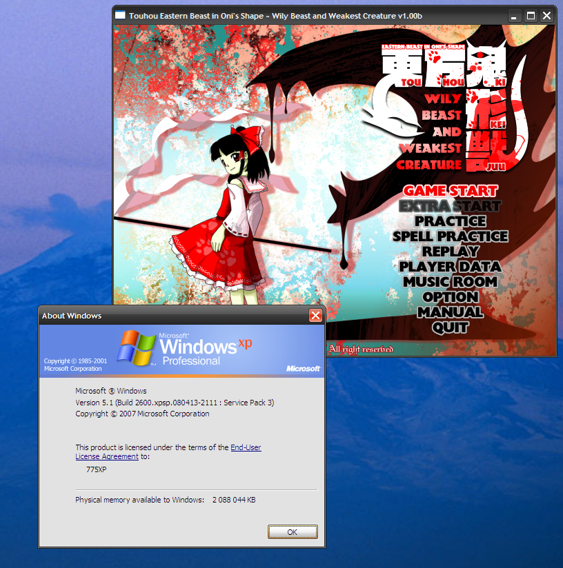
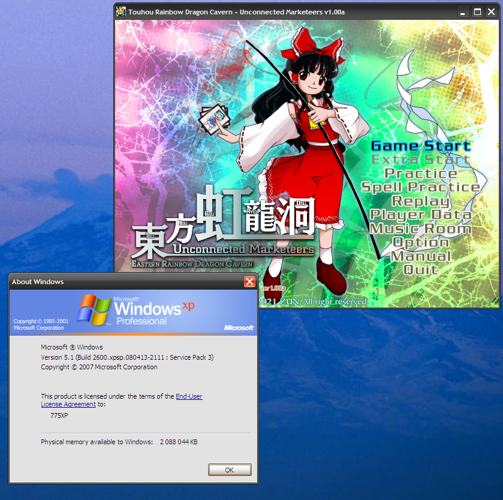
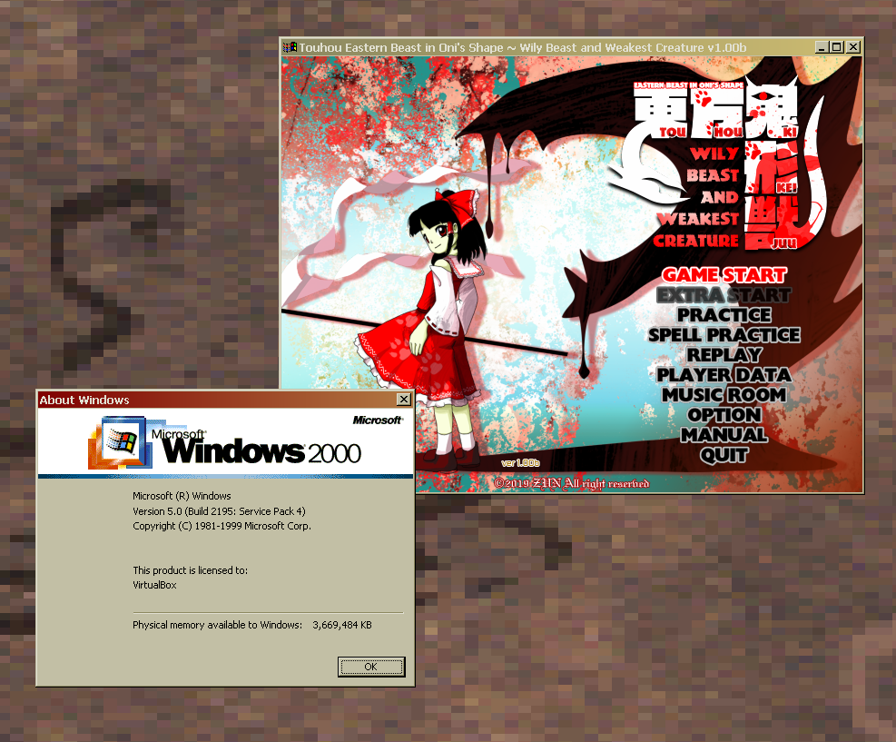
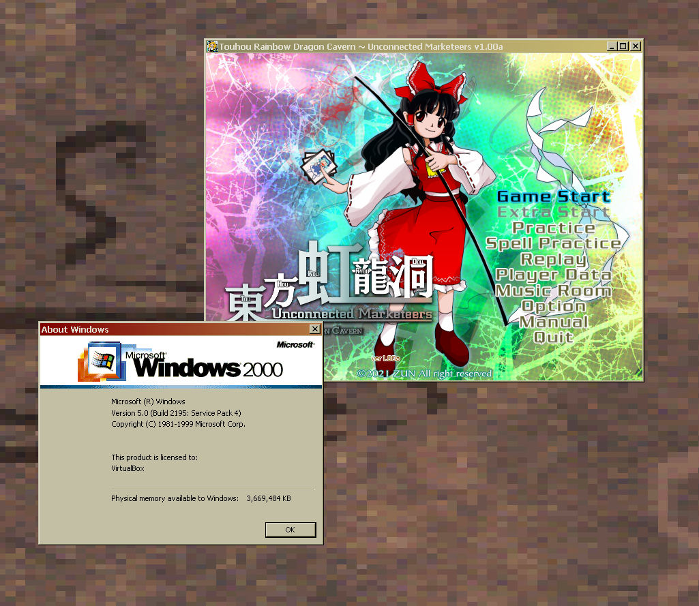

# Patcher for TH17 and TH18 executables (trial and full) to run on unmodified Windows XP

## How?
This patch modifies the header values of the executables to require Windows 2000 instead of Windows Vista. Without this patch, you will get `thXX.exe is not a valid Win32 application` error. Touhou 17 and 18 uses only APIs availible in XP (and 2000 Extended Kernel), so this patch can just work. In total, only 2 bytes get patched.

## Installation

### Unmodified Windows XP
Download patcher.exe from Releases (or compile it from source) and drag and drop the executable for thXX.exe and custom.exe separately onto the patcher. If you use THCRAP don't worry about the errors and warnings about an unrecognized game, it will work fine. Updating DirectX 9 to June 2010 can be nescesarry [link](https://dl.bobpony.com/software/dx/directx_Jun2010_redist.zip).

### Windows 2000 with Extended Kernel
No patching is nescesarry. However, you will need to update your DirectX 9 to December 2006 [link](https://dl.bobpony.com/software/dx/DX9/directx_dec2006_redist.exe) and download the DirectX 9 June 2010 [link](https://dl.bobpony.com/software/dx/directx_Jun2010_redist.zip). Due to the installer of June 2010 exitting on W2K, you will have to install 2 DLLs into the game files manually.
- `xinput1_3.dll` from `APR2007_xinput_x86.cab`
- `d3dx9_43.dll` from `Jun2010_d3dx9_43_x86.cab`

## What about Touhou 19 and future games?
Quoting [this article](https://www.thpatch.net/wiki/How_to_patch_a_new_Touhou_game_in_a_couple_of_hours#Tangentially_related:_Will_ZUN_finally_drop_Windows_XP_support_this_time?):
`Unfinished Dream of All Living Ghost, starting with version 0.02a, doesn't even support Windows 7 anymore. This is due to to the networking library the game uses, Photon. The game also uses a newer version of XInput then what Windows 7 has. Running the game on Windows 7 requires a custom winhttp.dll and a custom XInput1_4.dll. Running the game on XP will at the very least require OneCore in addition to that`.

However, future games without networking might be patchable.

## Known issues
- `custom.exe` refuses to work

## TODO
- Fix custom.exe issues
- Make a more user friendly patcher

## Screenshots

